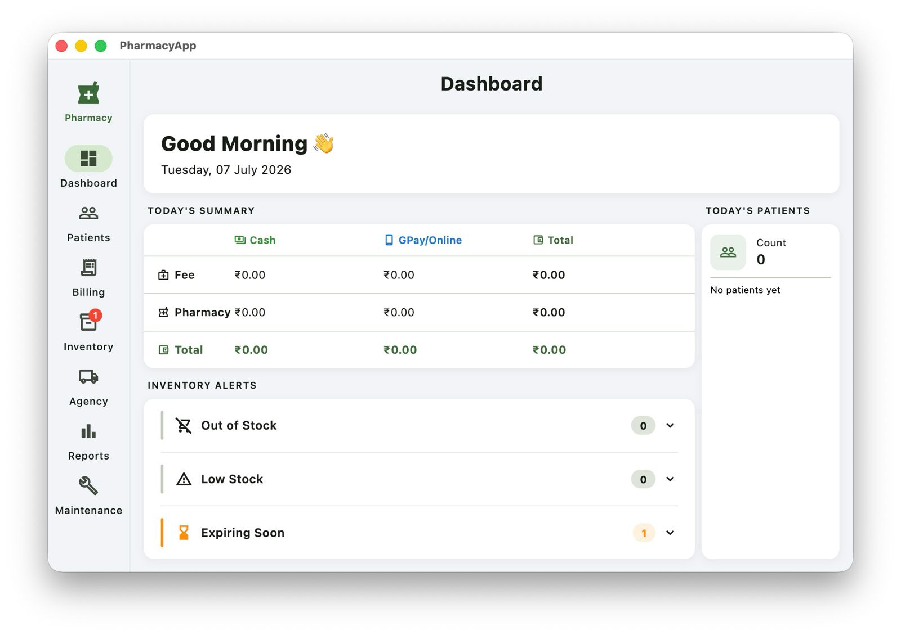
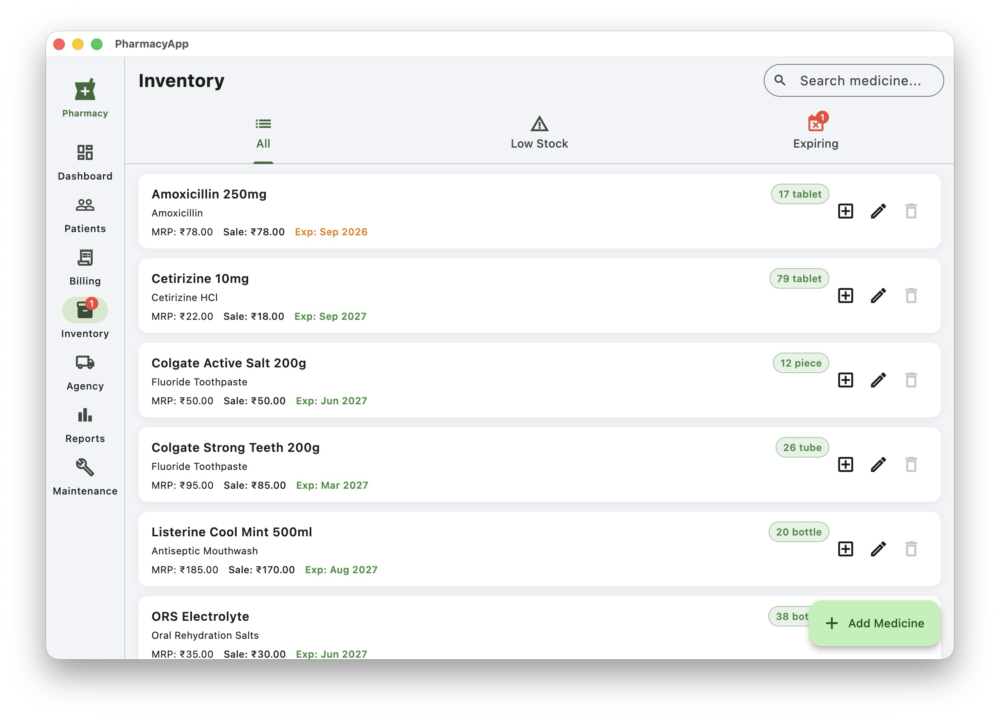
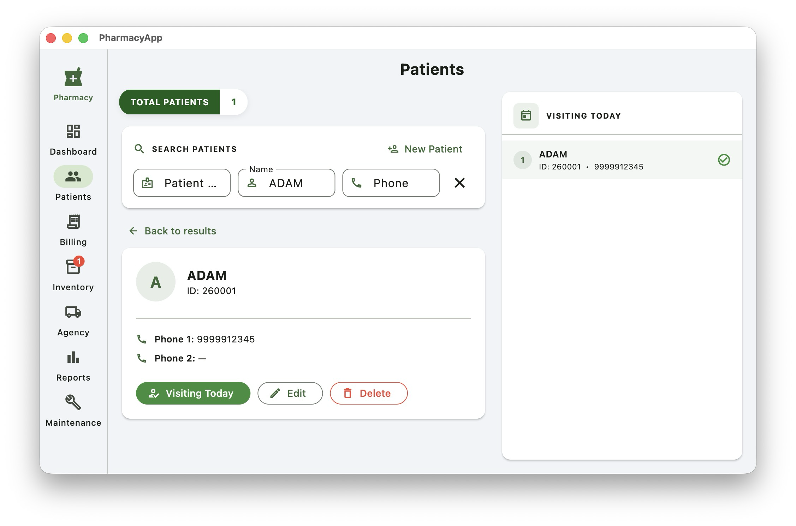
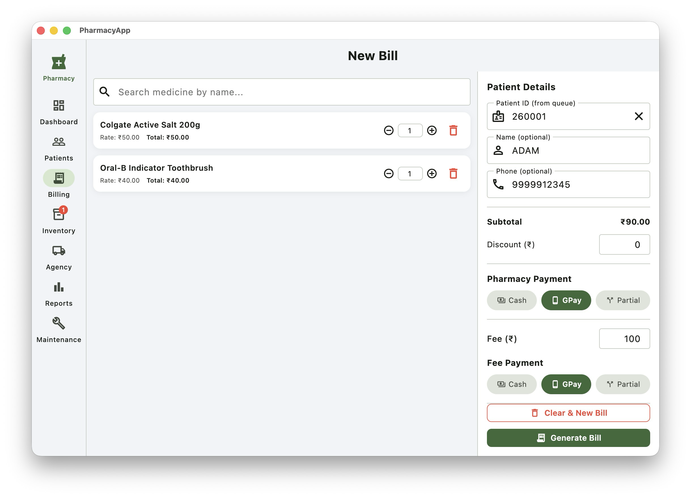
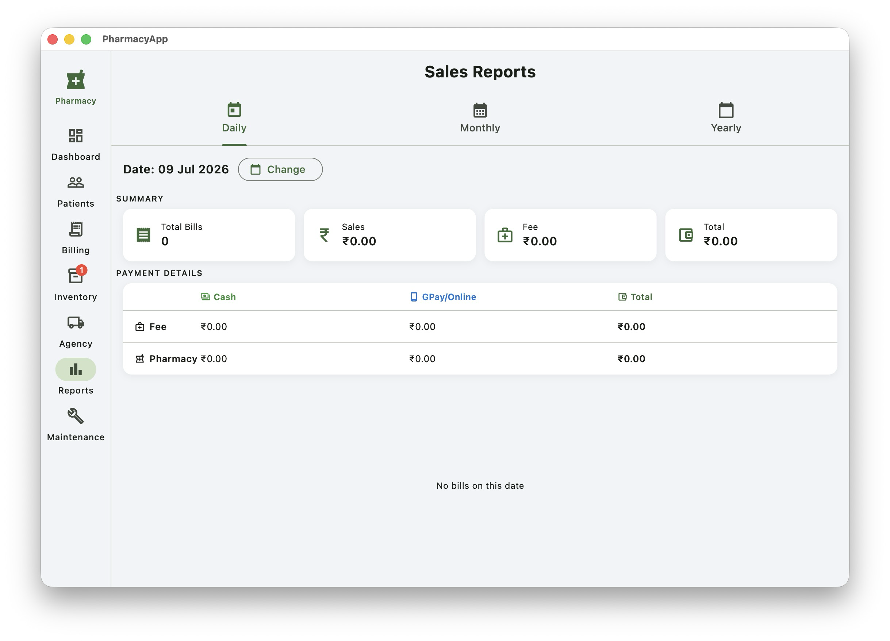
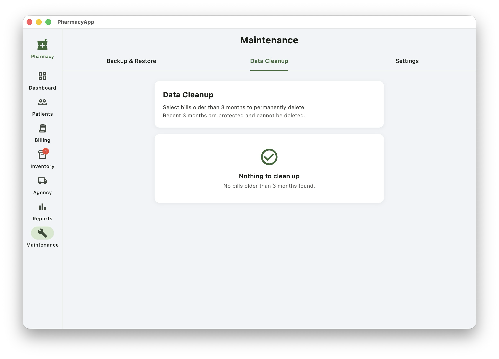

# PharmacyApp
*A simple, offline-first pharmacy management system built with Flutter and SQLite.*

The goal of this project is to provide a simple, fast, and offline-first solution for managing day-to-day pharmacy operations for small and medium-sized pharmacies.

## Project Status

🚧 Under active development.

The application is feature complete and is currently being prepared for its first public open-source release.

**Features**  
💊 Medicine Inventory Management  
🧾 Billing  
👥 Patient Management  
🚚 Agency Management  
📋 Reports 

📊 Dashboard  
⚙️ Maintenance  
🖥️ Windows Desktop Support  
🍎 macOS Development Support  
💾 SQLite Database (Offline First)  

**Technology Stack**
- Flutter
- Dart
- SQLite (sqflite)

**Getting Started**

``` shell
git clone https://github.com/Suryaeshwaran/pharmacy_app.git

cd pharmacy_app

flutter pub get

flutter run 
```

**Contributing**

Contributions, suggestions, and bug reports are welcome.

If you'd like to contribute, please open an issue to discuss your idea before submitting a pull request.

**License**

This project is planned to be released as open source. 
The license will be added before the first public release.

## Screenshots






