# PharmacyApp User Guide

## TOC
1. [Introduction](#1-introduction)
2. [System Requirements](#2-system-requirements)
3. [Installation](#3-installation)
4. [Getting Started](#4-getting-started)  
   4.1 [Store Settings](#41-store-settings)  
   4.2 [Inventory Management](#42-inventory-management)  
   4.3 [Patient Management](#43-patient-management)  
   4.4 [Billing](#44-billing)  
   4.5 [Agency](#45-agency)  
5. [Reports](#5-reports)
6. [Maintenance](#6-maintenance)
7. [Frequently Asked Questions](#7-frequently-asked-questions)
8. [Quick References](#8-quick-references)

## 1. Introduction

### About PharmacyApp

PharmacyApp is a desktop application built specifically for pharmacy operations, designed to simplify daily tasks like billing, inventory tracking, and patient management. It runs on  Windows, storing all data securely on your local computer — no internet connection required for day-to-day use.

### Who This Guide Is For

This guide is written for pharmacy staff and owners who will use PharmacyApp daily — no technical background required. Each chapter covers one part of the app, with step-by-step instructions and screenshots where helpful.

### What PharmacyApp Can Do

- **Billing** — Create bills quickly, generate PDF receipts, and share them directly via WhatsApp
- **Inventory Management** — Track stock levels, monitor expiry dates, and get alerts for low stock
- **Patient Management** — Maintain patient records and manage a visit queue
- **Agency Purchases** — Record purchases from supplying agencies and track payments
- **Reports** — View daily, monthly, and yearly business summaries
- **Maintenance** — PharmacyInfo Setting, Backup & restore, Data cleanup

### How This Guide Is Organized

Each chapter builds on the previous one. If you're setting up PharmacyApp for the first time, we recommend reading Chapters 2–5 in order before jumping to specific feature chapters. Experienced users can jump directly to the relevant chapter or use the Quick Reference for a fast lookup.

## 2. System Requirements

### Supported Operating Systems

PharmacyApp supports **Windows OS** (Windows 8 and above). 

| Requirement       | Minimum                     |
|--------------------|------------------------------|
| Operating System   | Windows 8 or later           |
| Architecture       | 32-bit or 64-bit             |
| RAM                | 2 GB                         |
| Disk Space         | General free space required for app and database growth |
| Display            | Standard desktop resolution  |

### Prerequisites — Windows Deployment

PharmacyApp requires the **Microsoft Visual C++ Redistributable Runtime** to be installed on the system.

If PharmacyApp fails to launch or shows a missing DLL error, this runtime is likely not installed (or is corrupted). To fix it:

1. Download the **All-in-One Visual C++ Redistributable package** from TechPowerUp
   - Search: *techpowerup visual c++ redistributable runtimes all-in-one*
2. Extract the downloaded zip
3. Run `install_all.bat` as **Administrator**
4. Restart the machine

This package installs all VC++ runtime versions (2005 through 2022) in sequence, and resolves cases where individual installers fail due to corrupted or partially installed prior versions.

> **Note:** This step only needs to be done once per computer, before installing PharmacyApp for the first time.

## 3. Installation

### Step 1: Locate the Installer File

You will receive a compressed file such as:

> PharmacyApp-v0.9.0.zip

*(The version number may vary depending on release.)*

### Step 2: Extract the Files

1. Open the downloaded `.zip` file — this usually opens automatically with **WinZip** or your default extraction tool.
2. Create a new folder on your computer to hold the application files — for example, **PharmacyApp** or **PharmaApp**.
3. Click **Extract To**, then select the folder you just created.
4. Wait for all files to be extracted into that folder.

### Step 3: Run PharmacyApp

1. Open the folder where you extracted the files.
2. Double-click **`pharmacy_app.exe`**.
3. The application will launch and you're ready to start using PharmacyApp.

### Step 4: (Optional) Create a Desktop Shortcut

For quicker access:

1. Right-click on **`pharmacy_app.exe`**.
2. Select **Send to → Desktop (create shortcut)**.
3. Use this shortcut going forward to open PharmacyApp directly from your desktop.

> **Tip:** Keep the extracted folder intact — do not move or rename individual files inside it, as PharmacyApp relies on files staying together in the same location.

## 4. Getting Started

### 4.1 Store Settings

Before creating your first bill, set up your pharmacy's details. These details appear automatically on every bill, PDF receipt, and WhatsApp share.

**Steps:**

1. Open PharmacyApp and go to the **Maintenance**.
2. Select **Settings** tab.

   
   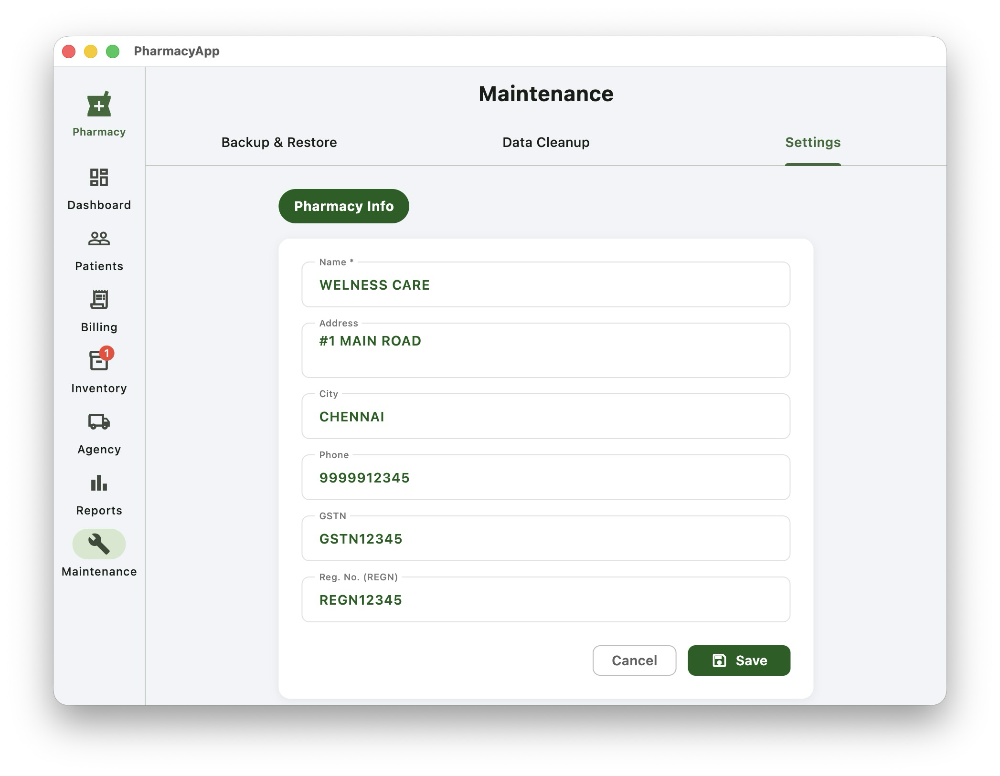

3. Enter your pharmacy details:

   | Field | Description |
   |-------|--------------|
   | Name | Your pharmacy's name |
   | Address | Street address |
   | City | City / town |
   | Phone | Contact phone number |
   | GSTN | GST registration number |
   | REGN | Pharmacy registration number |

4. Click **Save**.

> **Note:** Any field left blank will simply not appear on your bills — you don't need to fill in every field for the app to work correctly.

Once saved, these details will automatically appear on the header of every bill you generate — whether printed, saved as PDF, or shared via WhatsApp.

### 4.2 Inventory Management

The Inventory module is where you manage all medicines in stock — adding new medicines, adjusting quantities, and editing details.

#### Adding a Medicine

1. Go to the **Inventory** tab.
2. Click **+ Add Medicine** at the bottom right.
3. Fill in the required details:

   - Medicine Name
   - Stock Quantity
   - Low Stock Alert
   - Price/unit
   - Batch Number
   - Expiry Date

4. Click **Add Medicine** to save.

   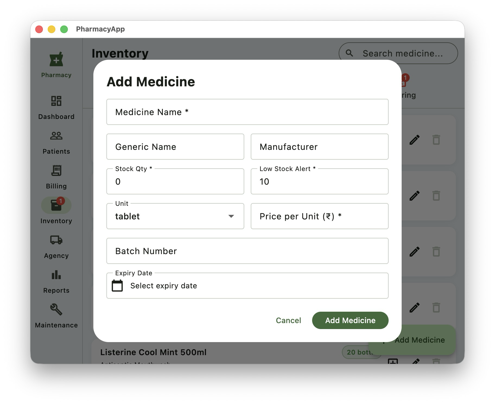

#### Managing Existing Medicines

Once added, medicines appear under the **All** tab. From here you can:

- **Adjust stock** — Click the **+** icon to add stock quantity.
- **Edit details** — Click the edit icon to update medicine information.

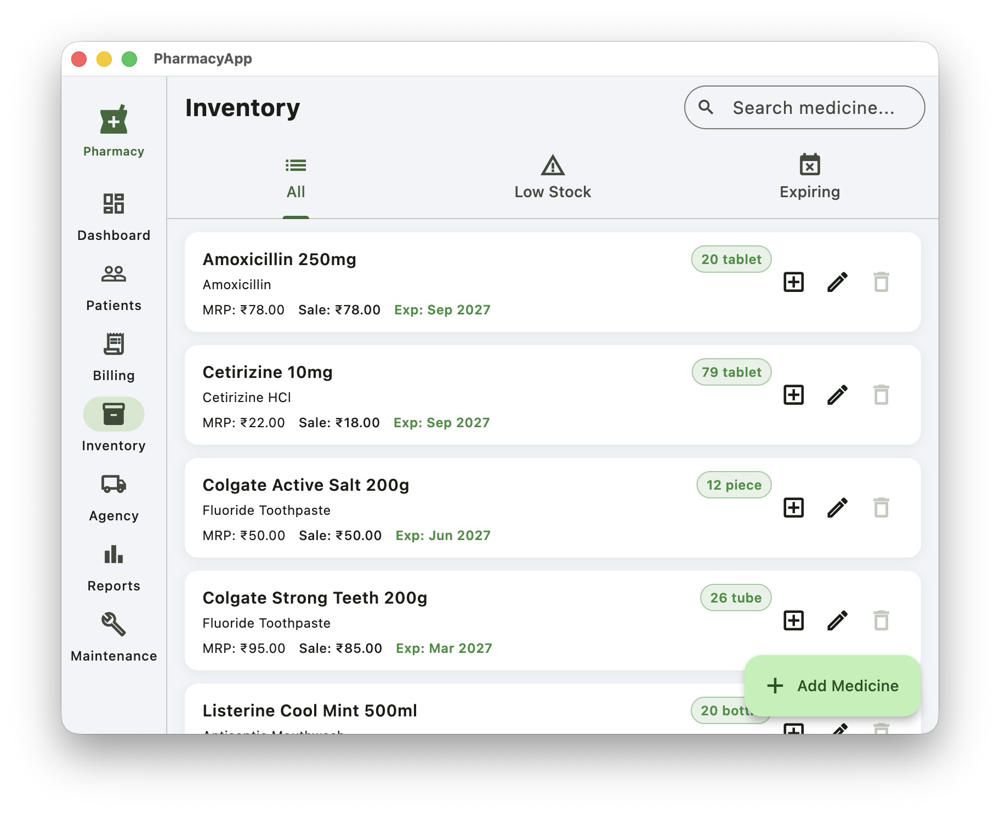

#### Deleting a Medicine

The delete option is only enabled once a medicine's stock reaches **0**. Medicines with remaining stock cannot be deleted — this prevents accidental loss of stock and billing records that are still tied to that medicine.

### 4.3 Patient Management

The Patient Management screen lets you maintain a record of patients, search for existing patients quickly during billing, and add patients to the "Visiting Today" list so they appear directly in the billing screen.

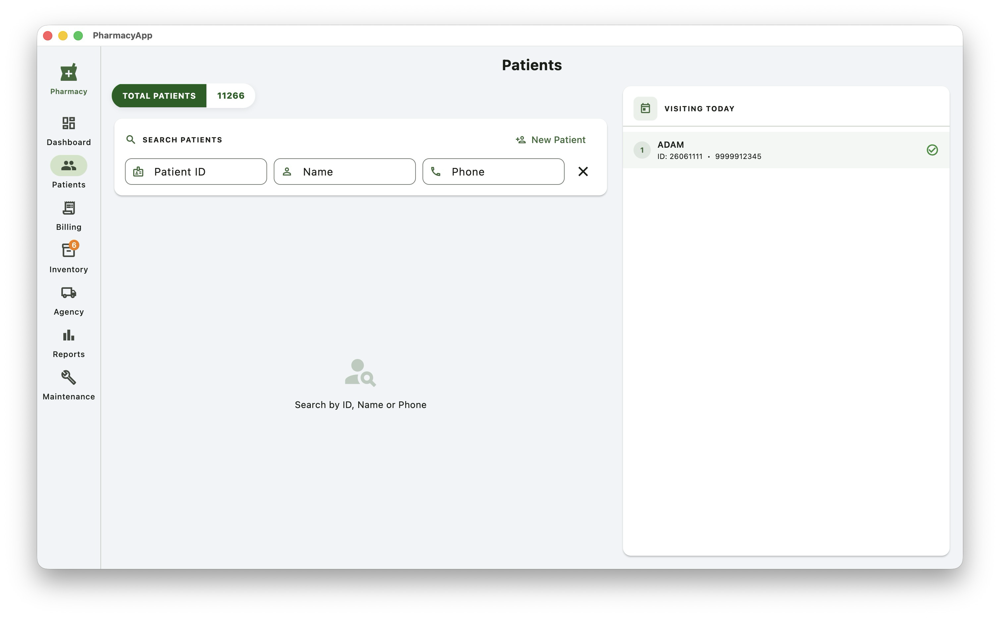

**Adding a New Patient**

1. Open the **Patients** screen from the main menu.
2. Click **Add Patient**.
3. Enter the required details:
   - Patient ID
   - Name
   - Phone Number
4. Click **Save** to add the patient to your records.

**Searching for a Patient**

1. Use the search bar at the top of the Patients screen.
2. Search by **Patient ID**, **Name**, or **Phone Number**.
3. Matching records will appear in the list below.

**Adding to Visiting Today List**

1. Search for the patient as described above.
2. Select the patient record from the search results.
3. Click **Add to Visiting Today**.
4. The patient will now appear in the Visiting Today list, and will be available for selection directly on the Billing screen.

*[On Search results Click "Visiting Today" to add to list]*

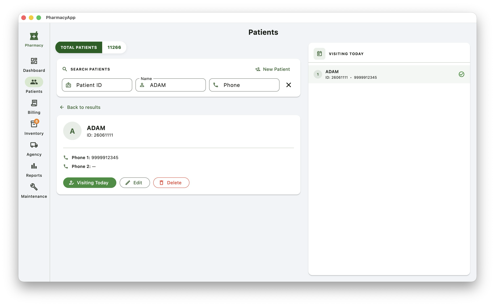

**Editing or Deleting a Patient Record**

1. Search for the patient you want to update.
2. Select the record from the search results.
3. Click **Edit** to update details, or **Delete** to remove the patient record.
4. Confirm the action when prompted.

> **Note:** Patients added to the Visiting Today list will show up automatically on the Billing screen, making it faster to select them during checkout without searching again.

### 4.4 Billing

The Billing screen is where you generate bills for patients, whether they're visiting today or walking in. It allows you to search medicines, record patient details, capture payments, and generate a shareable bill.

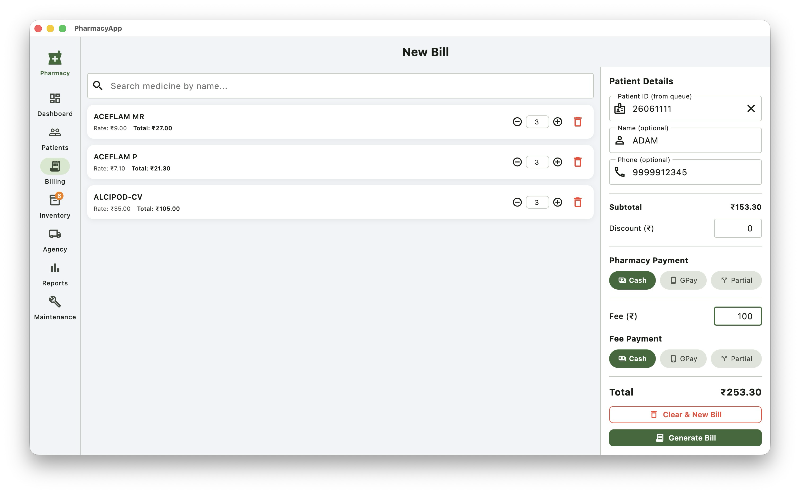

**Adding Medicines to the Bill**

1. Use the **Search Medicine** field to find the medicine by name.
2. Select the medicine from the search results.
3. Specify the required **quantity**.
4. Repeat to add multiple medicines to the same bill.

**Adding Patient Details**

You can add patient details in one of two ways:

- **From Visiting Today list:** Select a patient already added to the Visiting Today list (see [Patient Management](#43-patient-management)).
- **Manual entry:** Enter the patient's **Name** and **Phone Number** directly.

> **Note:** Adding a phone number allows you to share the bill via WhatsApp. If patient details are left blank, the bill will be saved as a **Walk-in** sale.

**Selecting Pharmacy Payment Method**

1. Choose the **Pharmacy Payment Method** for the medicine bill amount (e.g., Cash, UPI).

**Adding Fee Payment (if applicable)**

1. Enter the **Fee Amount**, if a consultation or service fee applies.
2. Select the **Fee Payment Method**.

**Generating the Bill**

1. Once medicines, patient details, and payment methods are entered, click **Generate Bill**.
2. This opens a **Bill Preview**.
3. From the preview, you can:
   - **Save and open as PDF**
   - **Share via WhatsApp**

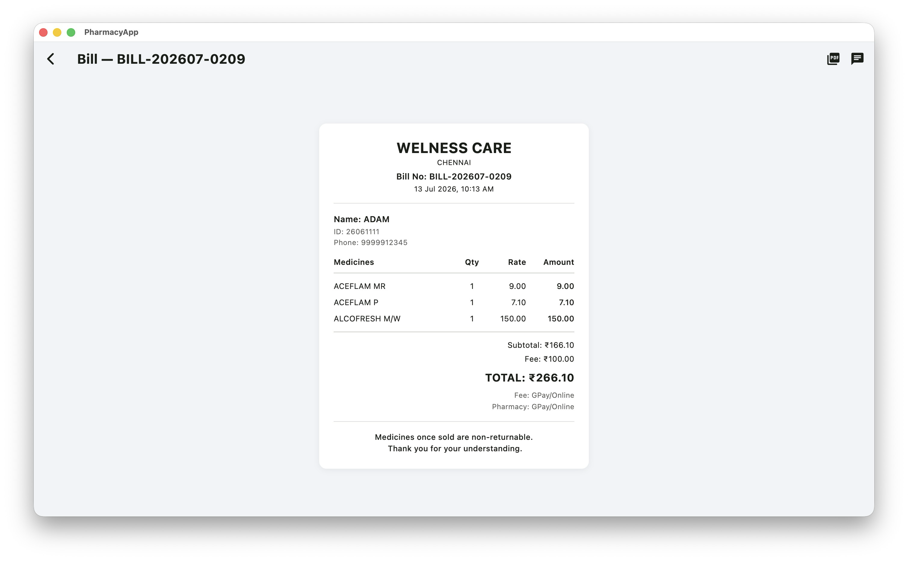

> **Note:** To edit or delete a bill after it has been generated, go to the **Reports** screen. See [Reports](#5-reports) for details.

### 4.5 Agency

The Agency screen lets you manage your medicine supplier agencies — adding agencies, recording their bills, and tracking payments made against those bills. It also provides a Reports tab for a monthly/yearly summary of agency bills and payments.

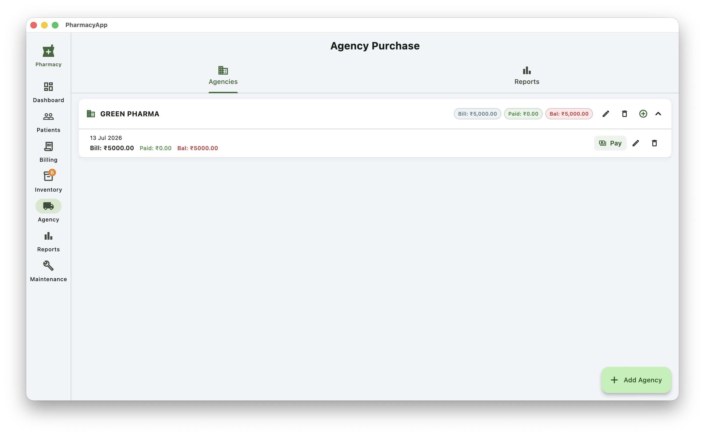

**Adding an Agency**

1. Open the **Agency** screen from the main menu.
2. On the **Agencies** tab, click **+ Add Agency** at the bottom right.
3. Enter the agency name and save.

**Adding a Bill for an Agency**

1. Select the agency from the list.
2. Click **Add Bill**.
3. Enter the bill details:
   - Bill Amount
   - Bill Date
   - Bill Number *(optional)*
4. Save the bill.

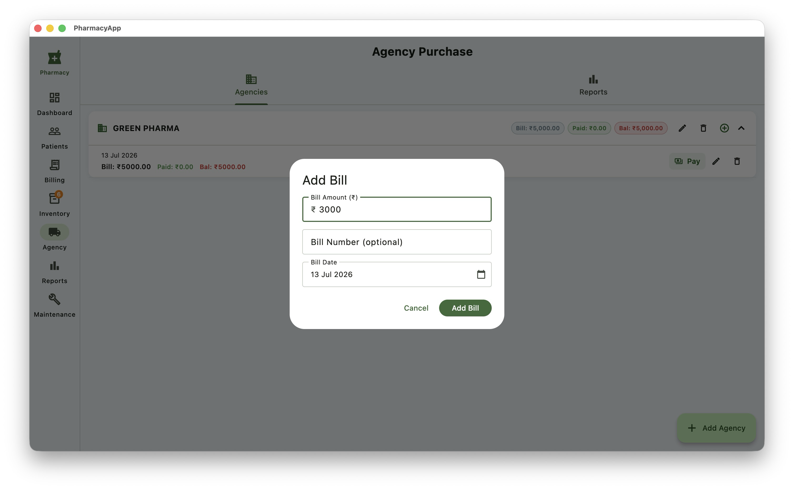

**Recording a Payment**

1. Expand an agency's dropdown to view its list of bills.
2. Select the bill you want to pay against.
3. Click **Pay** and enter the payment details.
4. Save to record the payment.

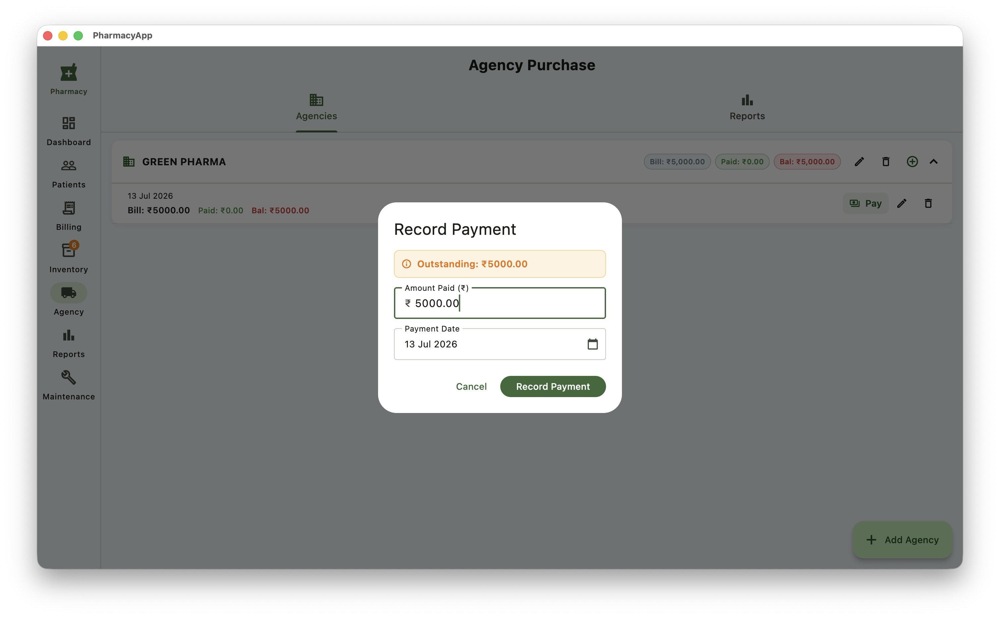

**Agency Reports**

1. Switch to the **Reports** tab on the Agency screen.
2. View a summary of **Monthly** and **Yearly** bills and payments made across agencies.

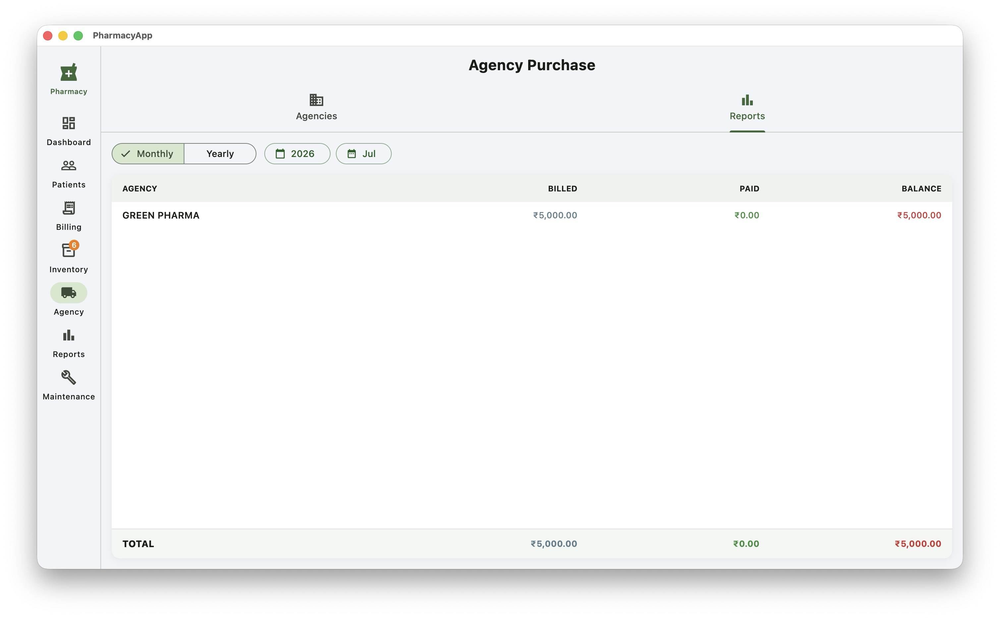

## 5. Reports

The Reports screen gives you a consolidated view of your sales activity, broken down by Daily, Monthly, and Yearly tabs. It's also where you can edit or delete previously generated bills.

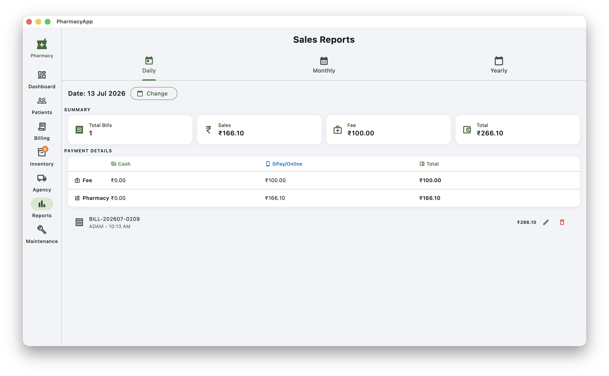

**Overview**

- The Reports screen opens by default to the **Daily** tab.
- Three tabs are available: **Daily**, **Monthly**, and **Yearly**.

**Daily Tab**

1. By default, shows **today's** bills.
2. Use the **date picker** to view bills for any previous date.
3. Each bill in the list shows the **Sales** and **Fee** amounts.
4. A **Total** (sum of Sales + Fee) is shown for the selected day.

**Editing or Deleting a Bill**

1. From the bill list (Daily, Monthly, or Yearly), select the bill you want to update.
2. Click **Edit** to modify the bill, or **Delete** to remove it.
3. Confirm the action when prompted.

> **Note:** Deleting a bill automatically restores the corresponding stock quantities back to inventory.

**Monthly Tab**

1. Switch to the **Monthly** tab.
2. View bills, Sales, Fee, and Total summarized for the selected month.

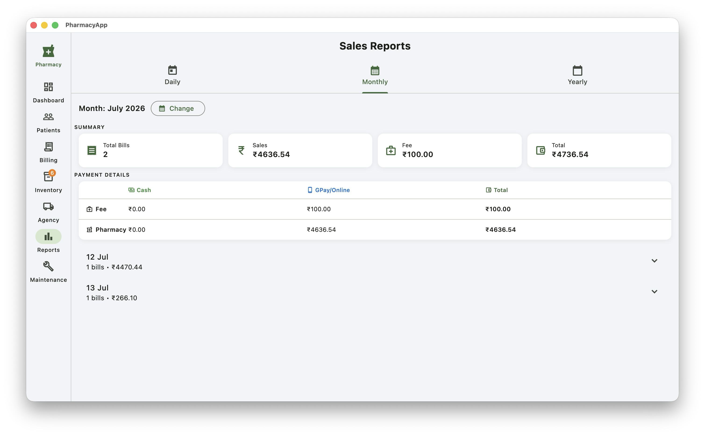

**Yearly Tab**

1. Switch to the **Yearly** tab.
2. View bills, Sales, Fee, and Total summarized for the selected year.

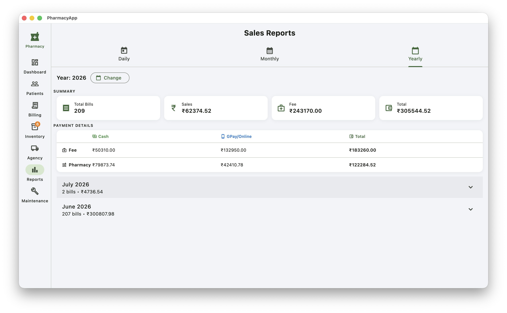

## 6. Maintenance

The Maintenance screen provides tools to back up and restore your data, clean up old bill records, and access store settings — all in one place, organized under three tabs.

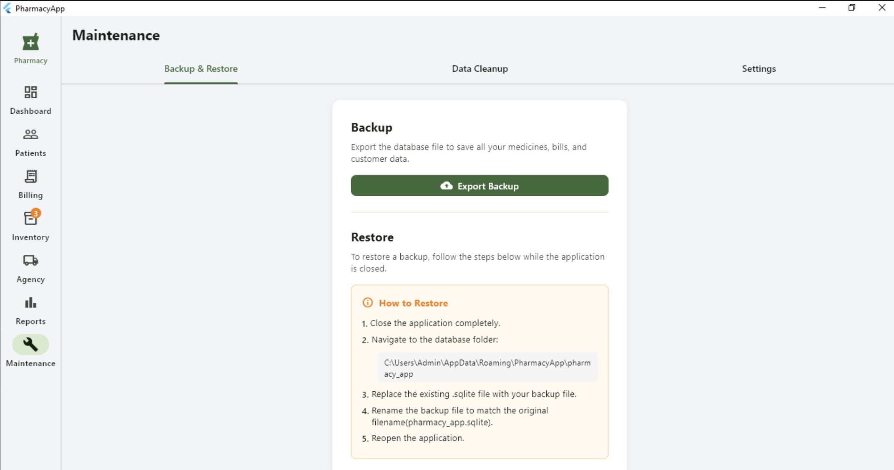

**Overview**

- The Maintenance screen has three tabs: **Backup & Restore**, **Data Cleanup**, and **Settings**.
- It opens by default to the **Backup & Restore** tab.

**Backup & Restore Tab**

*Export Backup*

1. Click **Export Backup**.
2. Choose the location where you want to save the backup file.
3. The database file (`.sqlite`) will be saved to the selected location.

*Restore*

1. Follow the on-screen steps provided under the **Restore** section to restore a previous backup.

> **Note:** It's recommended to take regular backups, especially before performing data cleanup or major updates.

**Data Cleanup Tab**

1. Switch to the **Data Cleanup** tab.
2. This lists months containing bills **older than 3 months**, which are eligible for deletion.
3. Select the month(s) you want to clean up and confirm deletion.

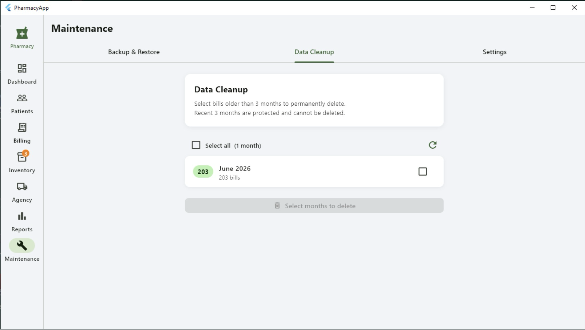

> **Note:** Deleted bills under cleanup are permanent — ensure a backup is taken before proceeding.

**Settings Tab**

This tab is the same as the **Store Settings** covered in [Getting Started # 4.1](#41-store-settings). Refer to that section for details.

## 7. Frequently Asked Questions

**Q: Does PharmacyApp need an internet connection to work?**  
No. All data is stored locally on your computer, and the app works fully offline for day-to-day billing, inventory, and patient management. An internet connection is only needed if you choose to share a bill via WhatsApp.

**Q: Can multiple staff members use PharmacyApp at the same time on different computers?**  
No. PharmacyApp stores data locally on a single computer, so it is designed for use on one machine at a time. It is not built for multiple users accessing the same data simultaneously across different computers.

**Q: Why can't I delete a medicine from Inventory?**  
The delete option is only enabled once a medicine's stock quantity reaches **0**. This prevents accidental loss of stock and billing records still tied to that medicine.

**Q: What happens to stock when I delete a bill?**  
When a bill is deleted from the Reports screen, the corresponding stock quantities are automatically restored back to Inventory.

**Q: I didn't fill in all the Store Settings fields — will my bills still work?**  
Yes. Any field left blank in Store Settings simply won't appear on your bills. You don't need to fill every field for the app to work correctly.

**Q: How do I share a bill with a patient who doesn't have a phone number?**  
If no phone number is entered, the bill is saved as a **Walk-in** sale. You can still save and open the bill as a PDF then print and share it, but WhatsApp sharing requires a phone number.

**Q: How do I print a bill?**  
Go to the **Reports** screen, find the bill, and open its **PDF preview**. From the PDF preview, use **Print (Ctrl+P)** to print the bill.

**Q: How do I edit or delete a bill?**  
Bills can only be edited or deleted from the **Reports** screen. Locate the bill under the Daily, Monthly, or Yearly tab, then select **Edit** or **Delete**.

**Q: Where is my data stored, and is it safe if my computer crashes?**  
All data is stored locally in a database file on your computer. To protect against data loss, take regular backups from **Maintenance → Backup & Restore**. See [Maintenance](#6-maintenance) for details.

**Q: PharmacyApp won't launch, or shows a missing DLL error. What do I do?**  
This usually means the Microsoft Visual C++ Redistributable Runtime is missing or corrupted. See [System Requirements](#2-system-requirements) for the fix using the TechPowerUp All-in-One Redistributable package.

**Q: I deleted the wrong bill or record — can I recover it?**  
Only if you have a recent backup. Use **Maintenance → Backup & Restore** to restore your data from a previously saved backup file. There is no undo for deletions otherwise.

**Q: How often should I back up my data?**  
It's recommended to take a backup regularly — for example, at the end of each day or week — and always before performing **Data Cleanup** or updating the app.

## 8. Quick References

A fast lookup for common tasks. For detailed steps, refer to the relevant chapter.

| Task | Where to Go |
|---|---|
| Set up pharmacy details | Maintenance → Settings |
| Add a new medicine | Inventory → + Add Medicine |
| Add stock to existing medicine | Inventory → **+** icon on medicine |
| Edit medicine details | Inventory → Edit icon |
| Delete a medicine | Inventory → Delete (only when stock = 0) |
| Add a new patient | Patients → Add Patient |
| Search for a patient | Patients → Search bar |
| Add patient to Visiting Today | Patients → Search → Add to Visiting Today |
| Edit/delete a patient record | Patients → Search → Edit/Delete |
| Create a bill | Billing → Search Medicine → Generate Bill |
| Save bill as PDF | Billing → Generate Bill → Save PDF |
| Share bill via WhatsApp | Billing → Generate Bill → Share via WhatsApp |
| Print a bill | Reports → open bill PDF preview → Ctrl+P |
| Edit or delete a bill | Reports → select bill → Edit/Delete |
| View daily/monthly/yearly sales | Reports → Daily / Monthly / Yearly tab |
| Add a new agency | Agency → + Add Agency |
| Add an agency bill | Agency → select agency → Add Bill |
| Record agency payment | Agency → expand bill → Pay |
| View agency reports | Agency → Reports tab |
| Back up data | Maintenance → Backup & Restore → Export Backup |
| Restore data | Maintenance → Backup & Restore → follow Restore steps |
| Delete old bills (3+ months) | Maintenance → Data Cleanup |